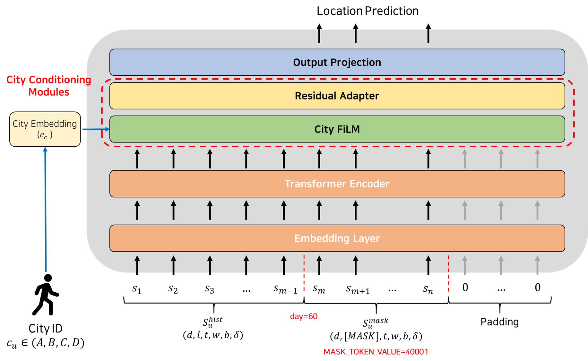

# SIGSPATIAL 2025 GIS Cup (HuMob Challenge) – SCSI Lab, Yonsei University

**Team:** SCSI Lab (Yonsei University, Dept. of Civil & Environmental Engineering)  
**Lead Contributor:** **Sehoon Oh** (Master’s Student)  
**Track:** 2025 GIS Cup – HuMob Challenge, Track 2 (Phase 1)

---

## 1. Overview

Our system introduces four key components:

1. **Multi-feature spatio-temporal embeddings**  
2. **CityCondBERT architecture for cross-city transfer**  
3. **Differentiable objective: `GeoBleuSinkhornLoss`**  
4. **Learning strategy**

---

## 2. Problem Definition

We address the task of **masked trajectory recovery**, where the goal is to reconstruct missing location tokens in a user’s spatio-temporal mobility sequence.

Each user $u$ has a (sparse) trajectory:

$$
\mathcal{T}_u = \{ (d^{(i)}, t^{(i)}, x^{(i)}, y^{(i)}) \in \mathbb{Z}^4 \ | \ i=1,\dots,N_u \},
$$

where $d^{(i)} \in [1,75]$ is the day index, $t^{(i)} \in [1,48]$ the half-hour slot, and $(x^{(i)}, y^{(i)}) \in [1,200]$ the grid coordinates.

From $\mathcal{T}_u$, we derive an enriched sequence:

$$
S_u = \{ (d^{(i)}, l^{(i)}, t^{(i)}, w^{(i)}, b^{(i)}, \delta^{(i)}) \ | \ i=1,\dots,N_u \},
$$

where $l^{(i)} = (y^{(i)} - 1)\cdot 200 + x^{(i)} \in \{1,\dots,40000\}$.  
Here, $w^{(i)} \in \{1,\dots,7\}$ denotes the day-of-week, $b^{(i)} \in \{1,2\}$ the weekday/weekend indicator (1 = weekday, 2 = weekend), and $\delta^{(i)} \ge 0$ the time gap since the previous observation.

We define a fixed masking window over the final 15 days:

$$
\mathcal{M}_u = \{ i \ | \ d^{(i)} \in [61,75] \}, 
\qquad
l^{(i)} = 40001 \ \text{ (i.e., [MASK]) if } i \in \mathcal{M}_u.
$$

Here, **40001 explicitly marks “to-be-predicted” locations**, following the masking strategy adopted in prior work such as ST-MoE-BERT [[1]](#ref1).

Because $N_u$ varies across users, we pad each sequence to a batch length $L$ with PAD $=0$; padded positions are excluded from attention (`attention_mask = 0`), while masked-future tokens $i \in \mathcal{M}_u$ remain active.

The model learns a mapping function:

$$
f_\theta(S_u) = \{ \hat l^{(i)} \ | \ i \in \mathcal{M}_u \},
$$

by minimizing the prediction error **only at masked positions** using both masked and unmasked parts of $S_u$.

---

## 3. Key Contributions

### 3.1 Multi-Feature Embeddings

**Motivation.**  
The enriched features $(d^{(i)},\, t^{(i)},\, l^{(i)},\, w^{(i)},\, b^{(i)},\, \delta^{(i)})$ differ in nature: discrete grids, cyclic calendar variables, and continuous gaps.  
To exploit these signals, we design complementary encoders:  
- **Categorical embeddings** for discrete IDs  
- **Periodic encodings** for cyclic proximity, following Wu et al. (2024) [[2]](#ref2)  
- **Learnable Fourier features** for continuous deltas, following Li et al. (2021) [[3]](#ref3)  

| Feature              | Notation      | Type / Encoding               | Dim.   |
|----------------------|---------------|-------------------------------|--------|
| Day index            | $d^{(i)}$    | Categorical                   | 64     |
| Time-of-day          | $t^{(i)}$    | Categorical ⊕ Periodic (48)  | 64 + 64|
| Day-of-week          | $w^{(i)}$    | Categorical ⊕ Periodic (7)   | 32 + 32|
| Weekday/Weekend flag | $b^{(i)}$    | Categorical                   | 16     |
| Location (grid ID)   | $l^{(i)}$    | Categorical                   | 256    |
| Delta (time gap)     | $\delta^{(i)}$ | Learnable Fourier (`log1p`) | 16     |

<br>

<p align="center">
  
</p>

<p align="center"><em>Figure 1. Embedding layer design combining categorical, periodic, and Fourier encoders.</em></p>

$$
E = 64 + (64+64) + (32+32) + 16 + 256 + 16 = \mathbf{544}
$$

Thus each timestep $i$ is represented as a token vector $\mathbf{h}^{(i)} \in \mathbb{R}^{544}$, obtained by concatenating all feature embeddings and then projected to the model dimension $d_{\text{model}}=384$.

---

### 3.2 CityCondBERT: Cross-City Transfer

We target four cities (**A, B, C, D**).  
Since B, C, and D have limited data, training separate models is impractical.  
**CityCondBERT** addresses this by sharing a BERT-style Transformer encoder, while conditioning on **city embeddings** to enable transfer from data-rich city A.

**Architecture.**  
Built on Hugging Face’s `BertModel` with hidden size $384$, 8 layers, 8 heads, and dropout 0.1.  
It consumes enriched token embeddings (§3.1) and outputs contextualized hidden states.

**City Conditioning.**  
Each city ID $c \in \{A,B,C,D\}$ maps to a vector $\mathbf{e}_c \in \mathbb{R}^{32}$.  
This embedding modulates the encoder via:  
- **FiLM:** city-specific scale/shift on hidden states.  
- **Adapters:** residual MLPs gated by city embeddings.  

<p align="center">
  
</p>

<p align="center"><em>Figure 2. CityCondBERT architecture for cross-city transfer.</em></p>

---

### 3.3 `GeoBleuSinkhornLoss`

**Goal.**  
Make GEO-BLEU **trainable** by turning n-gram matching into a **differentiable Sinkhorn-based alignment**.  
This builds on the original GEO-BLEU similarity measure for geospatial sequences [[4]](#ref4) and leverages the Sinkhorn-Knopp algorithm for entropy-regularized optimal transport [[5]](#ref5).

**1) Local geometry.**  
Neighboring cells should be treated as partially correct.  
For each true cell $y_j$, a local window (e.g., $7\times7$) is expanded and neighbors are weighted by distance decay:

$$
\omega(\Delta r, \Delta c) = \exp(-\beta \, d_{\text{km}}(\Delta r, \Delta c)).
$$

**2) 1-gram similarity.**  
Given predicted distribution $p_{i,v}$, the similarity to true step $y_j$ is:

$$
U[i,j] = \sum_{k=1}^K p_{i,\, \text{nb}(y_j,k)} \cdot \tilde{\omega}_{j,k}.
$$

This captures spatial tolerance beyond exact matches.

**3) n-gram extension.**  
To model sequence patterns, define:

$$
S^{(n)}[i,j] = \prod_{t=0}^{n-1} U[i+t,\, j+t].
$$

This mimics BLEU’s n-gram precision but remains differentiable.

<p align="center">
  
</p>

<p align="center"><em>Figure 3. N-gram Similarity Matrix for n=2.</em></p>

**4) Sinkhorn alignment.**  
Each $S^{(n)}$ is softly aligned via entropy-regularized OT:

$$
M^{(n)} = \mathrm{Sinkhorn}(S^{(n)}, \varepsilon),
\qquad
q_n = \langle M^{(n)}, S^{(n)} \rangle.
$$

**5) Loss.**  
Aggregate over n-grams with weights $w_n$:

$$
L_{\mathrm{GeoBLEU}} = - \sum_{n=1}^5 w_n \log(q_n)
$$

---

### 3.4 Learning Strategy

Our training follows a **pretrain → finetune** paradigm:

- **Pretraining.**  
  The model is first pretrained on combined multi-city data (A, B, C, D).  
  This stage focuses on learning general spatio-temporal representations without city-specific bias.  
  A standard **CrossEntropy (CE)** objective is used to ensure stable convergence.
- **Finetuning.**  
  Starting from the pretrained weights, the model is finetuned on each target city using a **combo loss**:  

  $$
  L = \alpha \cdot L_{\mathrm{CE}} + (1 - \alpha) L_{\mathrm{GeoBLEU}}
  $$

  with an **α-scheduler** that gradually shifts focus from CE to GeoBLEU, balancing token-level accuracy and trajectory-level coherence.  
  During this stage, **embedding layers, input projection, and the BERT backbone are frozen**, while **FiLM, Adapters, and the output head** remain trainable.

<p align="center">
  
</p>

<p align="center"><em>Figure 4. Cross-City Transfer Learning Strategy.</em></p>

---

## 4. Results

We evaluate our approach on the four benchmark cities (A–D), comparing against a BERT baseline trained **from scratch**. The last column reports the relative GEO-BLEU improvement over scratch.

| Methods                       | A (GEO-BLEU↑) | B (GEO-BLEU↑) | C (GEO-BLEU↑) | D (GEO-BLEU↑) | Δ vs Scratch (%) |
|-------------------------------|---------------|---------------|---------------|---------------|------------------|
| **BERT (scratch)**            | 0.1224        | 0.1145        | 0.1069        | 0.0993        | –                |
| **CityCondBERT (pretrain)**   | 0.1275        | 0.1381        | 0.1276        | 0.1231        | +17.07%          |
| **CityCondBERT + FT (CE)**    | <u>0.1299</u> | <u>0.1397</u> | <u>0.1296</u> | <u>0.1265</u> | +19.21%          |
| **CityCondBERT + FT (Combo)** | **0.1313**    | **0.1420**    | **0.1311**    | **0.1280**    | **+20.73%**      |

---

## 5. Running

The pipeline is organized into three main entry points:  

- **`main_pretrain.py`** – trains a shared encoder on all cities jointly (multi-city pretraining).  
- **`main_transfer.py`** – loads pretrained weights and finetunes the model on a specific target city (per-city adaptation).  
- **`main_mask.py`** – performs masked prediction and evaluates the model, saving metrics and CSV outputs.

```bash
{run_dir}/
├── config.json     # snapshot of parameters at training start
├── run_meta.json   # metadata (seed, host, timings)
├── train_log.txt   # per-epoch training/validation logs
├── bert_best.pth   # best checkpoint (by validation GEO-BLEU)
├── bert_final.pth  # final checkpoint (last epoch)
├── results/
│   ├── test/       # per-city token-level predictions (CSV)
│   ├── metric/     # per-city UID-level evaluation (CSV)
│   ├── mask/       # submission-style masked recovery outputs
│   └── summary.txt # aggregated global + per-city metrics
```

---

## 7. References

[<a id="ref1">1</a>] He, H., Luo, H., & Wang, Q. R. (2024, October). **ST-MoE-BERT: A Spatial-Temporal Mixture-of-Experts Framework for Long-Term Cross-City Mobility Prediction.** In *Proceedings of the 2nd ACM SIGSPATIAL International Workshop on Human Mobility Prediction Challenge* (pp. 10–15).  

[<a id="ref2">2</a>] Wu, X., He, H., Wang, Y., & Wang, Q. (2024). **Pretrained mobility transformer: A foundation model for human mobility.** *arXiv:2406.02578*.  

[<a id="ref3">3</a>] Li, Y., Si, S., Li, G., Hsieh, C.-J., & Bengio, S. (2021). **Learnable Fourier Features for Multi-Dimensional Spatial Positional Encoding.** *Advances in Neural Information Processing Systems (NeurIPS 2021)*, 34, 15816–15829.  

[<a id="ref4">4</a>] Shimizu, T., Tsubouchi, K., & Yabe, T. (2022). **GEO-BLEU: Similarity measure for geospatial sequences.** *Proceedings of the 30th International Conference on Advances in Geographic Information Systems (SIGSPATIAL ’22)*, 1–4. ACM. https://doi.org/10.1145/3557915.3560985  

[<a id="ref5">5</a>] Cuturi, M. (2013). **Sinkhorn distances: Lightspeed computation of optimal transport.** *Advances in Neural Information Processing Systems (NeurIPS 2013)*, 26, 2292–2300.  
